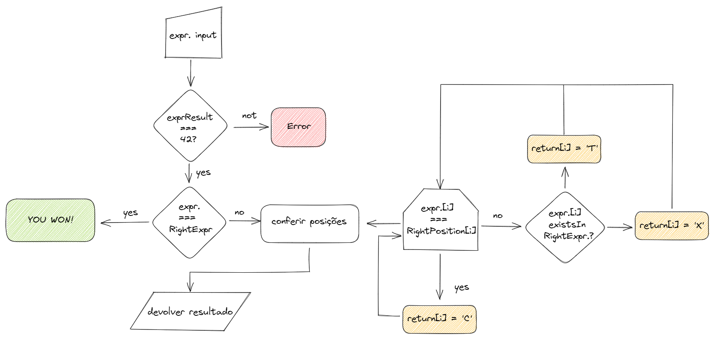

# Don't Panic Baby

## Summary
* [**Introdução**](#introdução)
* [**Regras do Jogo**](#regras-do-jogo)
* [**Pré Requisitos**](#pré-requisitos)
* [**Instalação**](#instalação)
* [**Developer Section**](#developer-section)

## Introdução
Este projeto consiste em um jogo divertido para aprender os conceitos e tecnologias no mundo web atual.
O jogo consiste em tentar descobrir a equação que resulta em "42". Cada tentativa deve ter como resultado o número alvo (42) e depois de cada tentativa, "characteres dicas" serão fornecido, exibindo o quão próximo você está de advinhar a equação secreta.

## Regras do Jogo

Digite uma equação que o resultado seja 42. Characteres serão retornados, descrevendo o quão próximo a sua equação palpite está da equação escondida.

#### Characteres
* "T" significa que o character do palpite existe na equação escondida, porém não está na posição correta
* "X" significa que o charactere palpite não pertence a equação escondida.
* "C" significa que o charactere palpite existe na equação escondida e está na posição correta.


## Pré-requisitos

* Instalar ```Python 3.8``` e ```pip```.
## Instalação

Uma vez que o repositório tenha sido clonado, os passos seguintes devem ser executados:

```bash
  cd labs-dontpanic_baby
  pip3 install -r requirements.txt
  uvicorn main:app --reload
```
    
## Developer Section
Seção destinada para descrição de itens interessantes principalmente para desenvolvedores, podendo ser irrelevante para usuários comuns.

<details>
<summary>Clique para expandir</summary>

### Fluxograma

O fluxograma a seguir descreve o fluxo dos dados. O mesmo foi usado para projetar a aplicação.



### Pastas
* **assets** Recursos para composição da documentação do projeto.
* **static** Arquivos do frontend.
* **test** Arquivos relacionados aos tests. Entre na pasta e execute-o com o comando ``pytest``.

</details>

